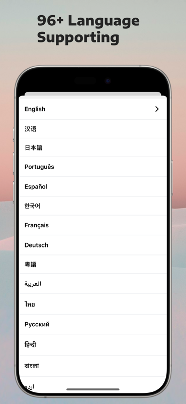

# Trans Trans

[](https://apps.apple.com/app/trans-trans/id6743046682)

A modern, open-source application built with React Native and Expo, designed to capture, transcribe, and refine your thoughts with ease and security. The backend Repo: https://github.com/dcalsky/transtrans-api/

## Screenshots

| Transcribe | Posts | i18n |
|:------:|:-----------:|:--------:|
|  |  |  |

## Tech Stack

### Core Technologies

- **React Native 0.77** - Cross-platform mobile framework
- **Expo 52** - Universal React platform
- **TypeScript 5.7** - Type-safe development
- **Expo Router** - File-based routing

### UI & Styling

- **NativeWind** - Tailwind CSS for React Native
- **Lottie React Native** - Animations

### State Management

- **Valtio** - Lightweight state management
- **React Hook Form** - Form handling

### Database & Storage

- **Drizzle ORM** - Type-safe SQL query builder
- **Expo SQLite** - Local database
- **Expo SecureStore** - Secure storage
- **AsyncStorage** - Local storage

## Quick Start

### Prerequisites

- Node.js (v18 or higher)
- npm
- Expo CLI (`npm install -g expo-cli`)
- Xcode (for iOS development)
- [Sentry](https://sentry.io/) api key
- [Vexo](https://www.vexo.co/) api key

### Development

1. **Clone the repository**

```bash
git clone https://github.com/dcalsky/transtrans-app.git
cd transtrans
```

1. **Install dependencies**

```bash
npm install
```

2. **Set up environment variables**

```bash
cp .env.example .env
# Edit .env with your configuration
```

3. **Run database migrations**

```bash
npm run db:migrate
```

4. **Start the development server on your device/simulator**

```bash
npm run ios
```

## Internationalization

TransTrans supports multiple languages with easy extensibility:

- **English** (`en`)
- **Chinese** (`zh`)
- **Japanese** (`ja`)
